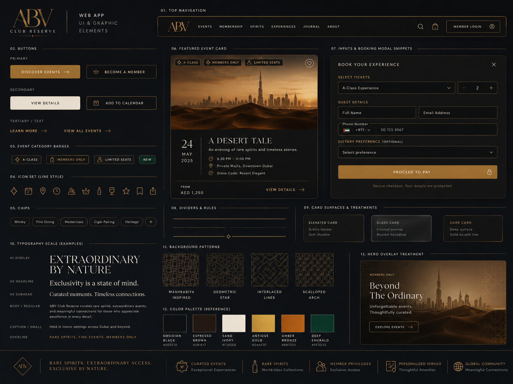

# ABV Club Reserve App POC Specification

## Purpose

The POC demonstrates a private premium club experience where members can sign in, browse curated opportunities, and open detail pages for events, sales, classes, and exclusive take away experiences.

## Product Principles

- The app must feel premium, selective, and easy to understand.
- The experience must be simple enough for a POC while still showing the full user journey.
- All app copy, UI labels, event content, comments, and documentation must be written in English.
- The POC should prioritize believable content and smooth navigation over production-level backend behavior.

## POC Scope

### In Scope

- Login screen with email and password fields.
- Main authenticated home screen after login.
- Home screen sections for:
  - Events
  - Exclusive Sales
  - Masterclasses
  - Exclusive Take aways
- Horizontal carousel behavior for upcoming events.
- Cards for individual items in each section.
- Section entry points that open a full section page.
- Card entry points that open a detail page for the selected item.
- Detail pages with enough content to understand the offer or experience.
- Mock data suitable for a premium alcohol club demo.

### Out of Scope For The First POC

- Real authentication.
- Real payments.
- User account management.
- Inventory management.
- Booking confirmation emails.
- Admin tools.
- Backend API integration.
- Multi-language support.

## Primary User Journey

1. The user lands on the login page.
2. The user enters an email address and password.
3. The user taps the sign-in action.
4. The app opens the main home screen.
5. The user scans curated sections.
6. The user can either:
   - Tap a section to open the full section page.
   - Tap a card to open the corresponding detail page.
7. On a detail page, the user can review the content and see a primary call to action.

## General

- The app name is ABV Reserve Club.
- The app is optimized for mobile first

## Screens

### Login Screen

The login screen is the unauthenticated entry point.

Required elements:

- Brand identity or app name : `ABV Club Reserve`
- Email field.
- Password field.
- Sign-in button.
- Minimal premium visual treatment.
- background styled dubai image

Behavior:

- For the POC, any non-empty email and password can allow access.
- Validation can be lightweight.
- Failed login behavior is not required unless useful for the demo.

### Header

Once connected, a header is disaplyed on every page:
- Home button
- user connected information

### Home Screen

The home screen is the main authenticated dashboard.

Required sections:

- Events
- Exclusive Sales
- Masterclasses
- Exclusive Take aways

Each section should include:

- Section title.
- A small set of cards in a carousel 
- The user can browse horizontally through event cards.
- Tapping an event card opens the event detail page.
- A way to open the full section page.

Content should be visually rich and premium. Cards should ideally include imagery, title, short description, location or category metadata when relevant, and a date or availability cue when relevant.

### Events Section

Purpose:

Show upcoming events available to members.

Home behavior:

- Display upcoming events on a vertical
- A way to filter events by tags 
- Tapping an event card opens the event detail page.
- a way to get back to Home screen

Example content directions:

- Private tasting nights.
- Producer dinners.
- Limited cellar previews.
- Brand-hosted launch events.

Suggested card fields:

- Title
- Date
- Location
- Short description
- Image
- Availability status

### Exclusive Sales Section

Purpose:

Show private access to premium bottle sales and limited releases.

Home behavior:

- Display a curated row of sale cards.
- Tapping a sale card opens the sale detail page.
- Tapping the section entry point opens the full Exclusive Sales page.

Example content directions:

- Premium spirits.
- Rare wines.
- Limited-edition bottles.
- Member-only allocations.

Suggested card fields:

- Bottle or collection name
- Category
- Price or price range, if desired for the POC
- Availability status
- Short description
- Image

### Masterclasses Section

Purpose:

Show educational experiences related to alcohol, craft, tasting, and production.

Home behavior:

- Display a curated row of masterclass cards.
- Tapping a masterclass card opens the masterclass detail page.
- Tapping the section entry point opens the full Masterclasses page.

Example content directions:

- Winemaking fundamentals.
- Tequila production and terroir.
- Food and spirits pairing.
- Tasting technique.

Suggested card fields:

- Title
- Topic
- Host or expert
- Date or format
- Short description
- Image

### Exclusive Tequila Section

Purpose:

Show highly exclusive tequila-related experiences that feel aspirational and rare.

Home behavior:

- Display a curated row of exclusive tequila cards.
- Tapping a card opens the detail page.
- Tapping the section entry point opens the full Exclusive Tequila page.

Example content directions:

- Private desert dinner.
- Distillery access.
- Small-batch tasting.
- Chef-led pairing experience.

Suggested card fields:

- Title
- Location
- Date or availability
- Short description
- Image
- Exclusivity cue

## Section Pages

Each section page should show the full list of items for that category.

Required elements:

- Section title.
- Optional short section description.
- List or grid of cards.
- Navigation back to the home screen.

Recommended behavior:

- Cards remain consistent with the home screen cards.
- Each card opens the corresponding detail page.

Potential POC simplification:

- Section pages can use static mock content.
- Filtering and sorting are not required for the first POC.

## Detail Pages

Each item detail page should provide enough information to make the content feel concrete.

Required elements:

- Title.
- Large image or strong visual header.
- Category label.
- Description.
- Relevant metadata:
  - Date, location, and availability for events and experiences.
  - Price, bottle details, and availability for sales.
  - Host, topic, duration, and format for masterclasses.
- Primary call to action.
- Navigation back to the previous screen or home.

Possible calls to action:

- Request Access
- Reserve a Seat
- Join Waitlist
- View Allocation
- Save

POC behavior:

- Calls to action can show a simple success or confirmation state.
- No real booking, payment, or account logic is required.

## Navigation Model

Minimum navigation paths:

- Login screen to home screen.
- Home screen to section page.
- Home screen card to detail page.
- Section page card to detail page.
- Detail page back to previous page or home screen.

Potential implementation options:

- Single-page app state routing.
- Simple hash-based routing.
- Static pages with lightweight JavaScript navigation.

The final implementation approach should be selected later, after the specification and design direction are approved.

## Mock Content Requirements

The POC should include enough sample content to make each section feel real.

For each section, a folder contains a md template shall be made with information to be filled. 
Each event is described in a md file and the app should read these files to create events

Tone:

- Premium.
- Concrete.
- Concise.
- No placeholder copy in the final demo.

## Design inputs

design boards : 

## Technology

App should be written in typescript REACT, VITE, and tailwind css with shadcn/ui

## Open Questions

- Should prices be shown for exclusive sales, or should they use request-based language?
- Should events and experiences have capacity or scarcity indicators?
